# Introduction

These steps would be useful for customers at the beginning of their journey with Azure OpenAI - and wanting to perform:

* Fronting their openAi endpoints with Azure APIM Rate limiting based on api-key header / or authorization headers
* Simple Load balancing across multiple openAI backend endpoints to handle Throttle events (429s). The load balancing piece was inspired by this [StackOverflow post](https://stackoverflow.com/questions/76188072/in-azure-api-management-how-can-you-load-balance-and-failover-on-3-different-ba)


Please note that APIM is not natively designed to be a load balancer - but with the below APIM policies we can make it smart in the way it routes requests to different backends based on HTTP response codes - before sending the responses back to the clients.

Like anything in life - there are many other approaches to perform the load balancing / smart routing piece. You could leverage an Azure Application gateway, other reverse proxy technolocies between APIM and the openAI endpoint and leveraging custom routing rules, or another option is to use a simple webapi to perform the load balancing work for you such as this [sample](https://github.com/anevjes/openAiLoadBalancer) I have also written. The reason why I have chosen using APIM for smart routing is simply to reduce additinal needs for more components given most customers in azure will already have APIM stood up and will use it for rate limiting already.


Alright lets see how this could be configured then, shall we?

# Import the Azure OpenAI OpenAPI definition

## Prerequisites

Downlaod the approiate azure openAI open api definition file. In this example i will be using this as my reference:

https://github.com/Azure/azure-rest-api-specs/blob/main/specification/cognitiveservices/data-plane/AzureOpenAI/inference/preview/2023-08-01-preview/inference.json

Open the json file and fix up the servers array to point to a valid URL as per:

default can be changed to your endpoint and save the file. It doesn;t matter too much whatn openai endpoint you place in here as we will dynamically be changing the endpoint via the Operaitonal Level APIM policy in later steps - jsut needs to be a valid endpoint to import the definition.

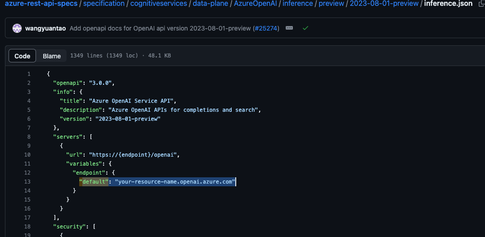


## Setting up API Backends

These are the URLs that policies will send requrests to rather than hard coding the urls in your policy code.

Under APIs section inside your APIM click on Backends:

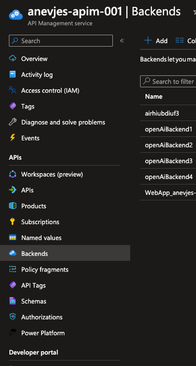


Click on the Add button and enter in the following fields as minimum - make sure to update your openai url and keep the /openai at the end:

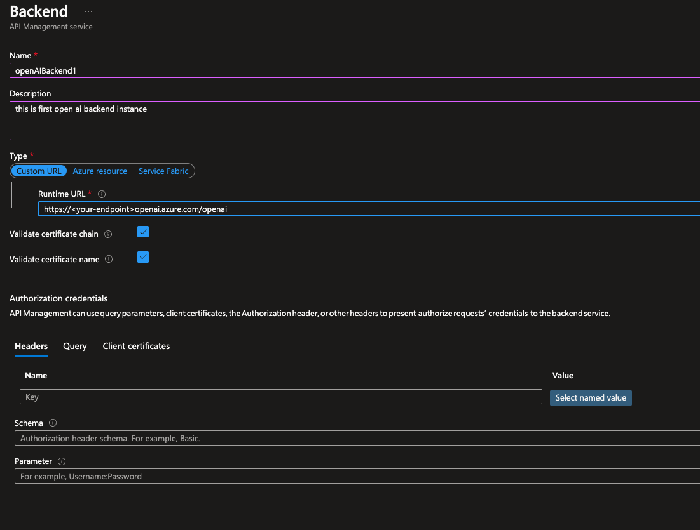


Click on APIs inside APIM -> Add API:

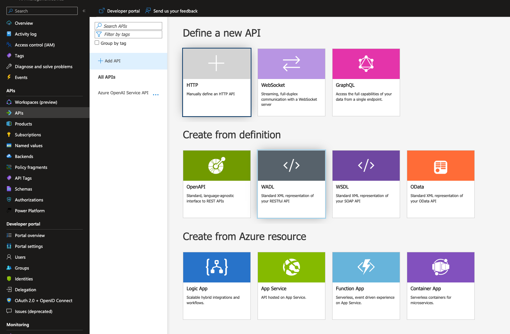

Click on Create from Defintion -> OpenAPI:

Now Select a File -> point to your local copy of the openAi openAPI definition that you prepped as part of the pre-requisites step above.

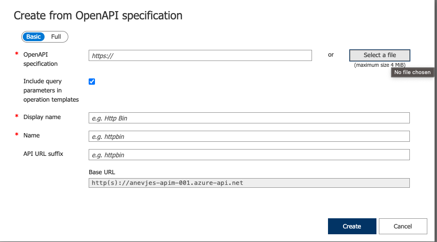

Now that you have succesfully completed the import of openAPI definition you should see the various operations under the newly imported API inside APIM:

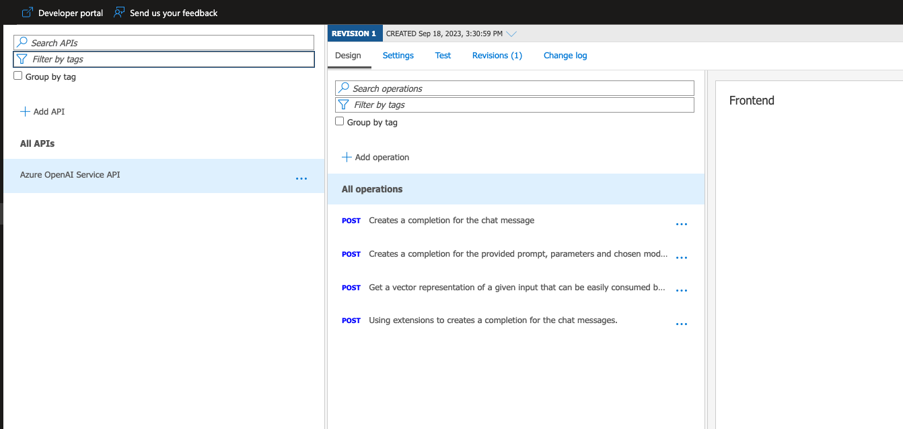


## Load balancing logic using APIM policies

Select "All Operations"
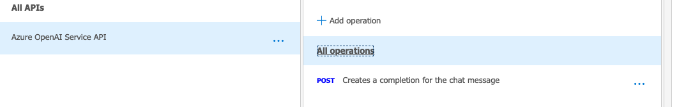

Under Inbound processing policy please click the code button:

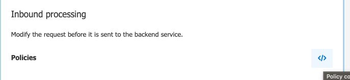


Now we will overwrite the entire policy XML with the below APIM policy which will apply across all operations. Make sure to line up the backend-id properties in below xml with the actual names you used in your Backends you configured a few steps earlier.

```xml
<!--
    IMPORTANT:
    - Policy elements can appear only within the <inbound>, <outbound>, <backend> section elements.
    - To apply a policy to the incoming request (before it is forwarded to the backend service), place a corresponding policy element within the <inbound> section element.
    - To apply a policy to the outgoing response (before it is sent back to the caller), place a corresponding policy element within the <outbound> section element.
    - To add a policy, place the cursor at the desired insertion point and select a policy from the sidebar.
    - To remove a policy, delete the corresponding policy statement from the policy document.
    - Position the <base> element within a section element to inherit all policies from the corresponding section element in the enclosing scope.
    - Remove the <base> element to prevent inheriting policies from the corresponding section element in the enclosing scope.
    - Policies are applied in the order of their appearance, from the top down.
    - Comments within policy elements are not supported and may disappear. Place your comments between policy elements or at a higher level scope.
-->
<policies>
    <inbound>
        <rate-limit-by-key calls="3" renewal-period="15" counter-key="@(context.Request.Headers.GetValueOrDefault("api-key", "default-value"))" />
        <base />
        <cache-lookup-value key="backend-counter" variable-name="backend-counter" />
        <choose>
            <when condition="@(!context.Variables.ContainsKey("backend-counter"))">
                <set-variable name="backend-counter" value="0" />
                <cache-store-value key="backend-counter" value="0" duration="100" />
            </when>
        </choose>
        <choose>
            <when condition="@(int.Parse((string)context.Variables["backend-counter"]) == 0)">
                <set-backend-service backend-id="openAiBackend4" />
                <set-variable name="backend-counter" value="1" />
                <cache-store-value key="backend-counter" value="1" duration="100" />
            </when>
            <when condition="@(int.Parse((string)context.Variables["backend-counter"]) == 1)">
                <set-backend-service backend-id="openAiBackend4" />
                <set-variable name="backend-counter" value="2" />
                <cache-store-value key="backend-counter" value="2" duration="100" />
            </when>
            <otherwise>
                <set-backend-service backend-id="openAiBackend4" />
                <set-variable name="backend-counter" value="0" />
                <cache-store-value key="backend-counter" value="0" duration="100" />
            </otherwise>
        </choose>
    </inbound>
    <backend>
        <retry condition="@(context.Response.StatusCode == 429)" count="3" interval="10" first-fast-retry="true">
            <choose>
                <when condition="@(context.Response.StatusCode == 429)">
                    <choose>
                        <when condition="@(int.Parse((string)context.Variables["backend-counter"]) == 0)">
                            <set-backend-service backend-id="openAiBackend4" />
                            <set-variable name="backend-counter" value="1" />
                            <cache-store-value key="backend-counter" value="1" duration="100" />
                        </when>
                        <when condition="@(int.Parse((string)context.Variables["backend-counter"]) == 1)">
                            <set-backend-service backend-id="openAiBackend4" />
                            <set-variable name="backend-counter" value="2" />
                            <cache-store-value key="backend-counter" value="2" duration="100" />
                        </when>
                        <otherwise>
                            <set-backend-service backend-id="openAiBackend4" />
                            <set-variable name="backend-counter" value="0" />
                            <cache-store-value key="backend-counter" value="0" duration="100" />
                        </otherwise>
                    </choose>
                </when>
            </choose>
            <forward-request buffer-request-body="true" />
        </retry>
    </backend>
    <outbound>
        <base />
        <set-header name="Next-Backend-Counter" exists-action="override">
            <value>@((string)context.Variables["backend-counter"])</value>
        </set-header>
        <!-- Uncomment for debugging, this outputs the next backend-counter in the JSON response body. -->
        <!--<set-body>@{ 
            JObject body = context.Response.Body.As<JObject>(); 
            body.Add(new JProperty("backend-counter", ((string)context.Variables["backend-counter"])));
            return body.ToString(); 
        }</set-body>-->
    </outbound>
    <on-error>
        <base />
    </on-error>
</policies>
```

When you save the policy you should see something like this applied across all operations under the openAI APIs:

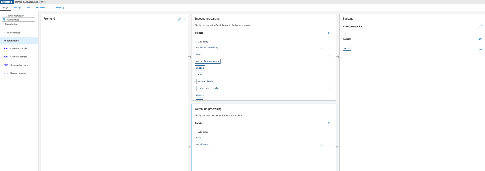

# Testing

Now click on one of the APIs you want to test out - select Test button and supply the call details:

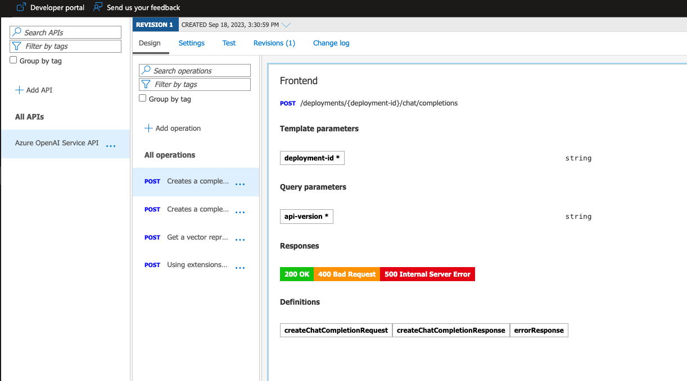

Run the call - initially you shold get a 200 response:

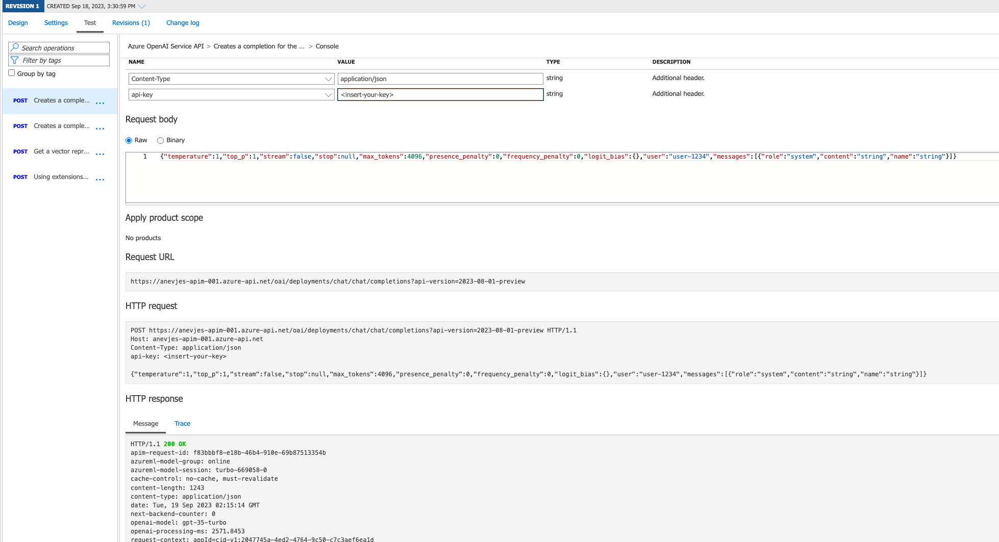

Hit it harder a few times to meet the rate-limit-by-key polict details and you should see throttling from APIM back to client returned:

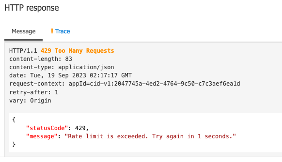

you can also test the load balancing solution by increasing your rate limit apim policy and throwing more laod to the openai backend and watch the policies swap out the backend urls. If you need ot troubleshoot the apim policy executions further you can uncomment this seciton in APIM policy:

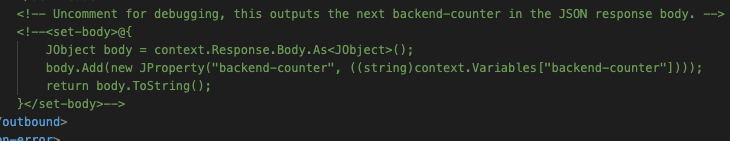

and also enable tracing inside PAIM under the test pane:

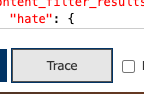
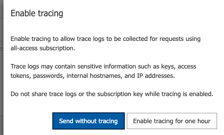

Happy openAi-ing.